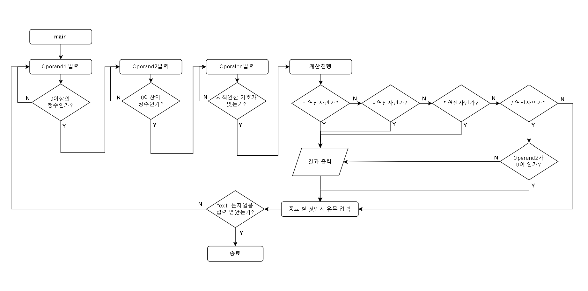

# Step1
## 요구사항 정의 및 설계
### * 요구사항 정의
- Console 기반 계산기
- 클래스 없이 **절차지향 방식**으로 함수 단위로 분리해서 작성
- 입력 조건
    - 0을 포함한 양의 정수 2개를 받음
    - 사칙 연산 기호 1개를 받음
        - +,-,x,/ 받기
    - 잘못된 입력을 받으면, 종료되지 않고, 다시 입력을 받도록 유도 (재시도)
- 종료 조건
    - 반복문을 사용하며, "exit" 문자열이 들어오면 종료
- 기능 요구 사항
    - 사칙연산 기호에 따라 적절한 연산 진행
    - if, switch 등의 제어문 활용
    - 연산 오류가 발생할 경우 해당 오류에 대한 내용 정제하여 출력
### * 설계

예외 케이스 발생 부분을 제외한, 기본적인틀에 대한 러프한 순서도

### * 목표
- 메모리나 GC에 오버헤드에 대해서 신경을 쓰면서 구성
- 테스트 케이스 작성을 통해서, 예외 케이스와 성공케이스에 대한 빠른 확인

### * 고려한 사항
- [고려한 사항 정리](docs-1.md)