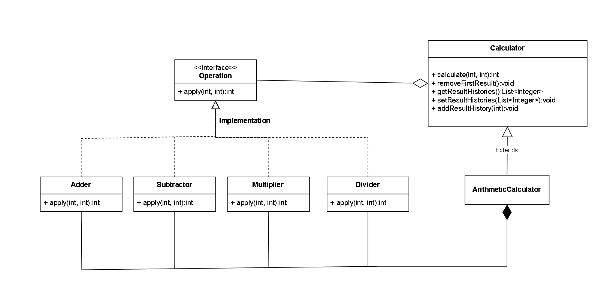

# Step2
## 요구사항 정의 및 설계
### * 요구사항 정의
- 사칙연산을 수행한 후 결과값을 반환하는 `calculate` 메서드 구현
- 연산 결과를 저장하는 컬렉션 타입 필드 보유
- `0` 이상인 양의 정수 2개와 사칙연산 기호를 매개변수로 받아 계산 수행
- 연산 결과는 내부 컬렉션에 저장
- 기존 Lv1에서 구현한 App의 main 메서드를 수정하여 Calculator 활용
- 연산 로직은 Calculator에서 수행
- App에서는 Scanner로 입력 받아 Calculator를 통해 계산 후 결과 출력
- 결과 저장은 Calculator 내부 필드에 자동으로 처리되도록 구성
- 소스 수정 전 기능이 동일하게 동작해야 함
- 연산 결과 컬렉션 필드는 외부에서 직접 접근 금지
- `Getter`, `Setter` 메서드를 통해 간접 접근 제공
- Calculator 클래스에 가장 먼저 저장된 연산 결과를 삭제하는 메서드 추가
- App 클래스의 main에서 해당 메서드 활용

### * 설계

* **`Operation` 인터페이스:** 계산 기능을 정의하는 틀 (두 정수를 받아 정수를 반환하는 `calculate` 메서드).
* **`Adder`, `Subtractor`, `Multiplier`, `Divider`:** 실제 덧셈, 뺄셈, 곱셈, 나눗셈 기능을 구현하는 클래스들. (`Operation` 인터페이스를 따름)
* **`Calculator` 클래스:** 계산 결과 저장 및 관리 기능을 가진 기본적인 계산기 클래스. 여러 `Operation` 기능을 활용할 수 있음.
* **`ArithmeticCalculator` 클래스:** `Calculator` 기능을 상속받아 기본적인 사칙연산 기능을 수행하는 계산기 클래스. 특정 `Operation` 기능을 필수적으로 사용함.

**핵심:** 연산 기능을 인터페이스로 분리하고, 이를 구현한 클래스들을 활용하여 다양한 계산 기능을 제공하는 구조입니다. `ArithmeticCalculator`는 기본적인 계산 기능을 상속받아 사칙연산을 수행합니다.