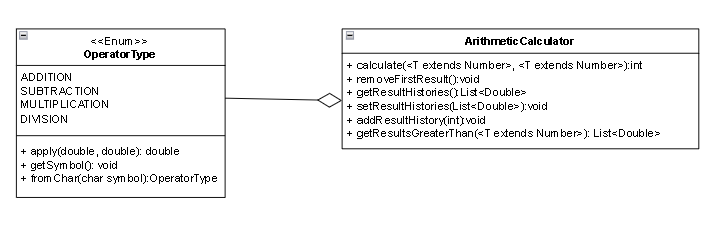

# Step3

## 요구사항 정의 및 설계

### \* 요구사항 정의

- [step-1](step-1.md), [step-2](step-2.md) 의 요구사항을 기본적으로 포함
- Enum 을 활용하여, Operator 를 선언
- double, integer, long 등 다양한 형태에 지원 가능하도록 제네릭을 활용하여 연산 진행 시 피연산자의 타입 선언
- Lambda & Stream 을 활용하여 Scanner 를 통해 받은 수 보다 큰 이전 결과 목록 출력

### \* 설계

- 기존 전략 패턴으로 구성된 부분을, `Enum` 을 통해서 관리하도록 변경
  - ADDITION, SUBTRACTION, MULTIPLICATION, DIVISION 의 4칙 연산에 해당하는 symbol 구성
  - 내부적으로 익명 함수를 통해서, apply 함수를 통해 연산을 진행할 수 있도록 구성
  
### \* 목표

- ErrorMessage 에 대한 부분을 `Enum`을 통해서 관리
- 아주 큰 수(int 이상 범위) 에서도 대응 될 수 있게 구성
- 이를 테스트를 통해서 체계화

